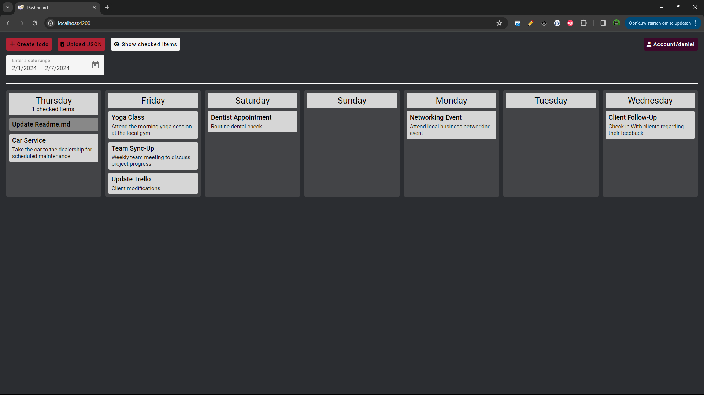
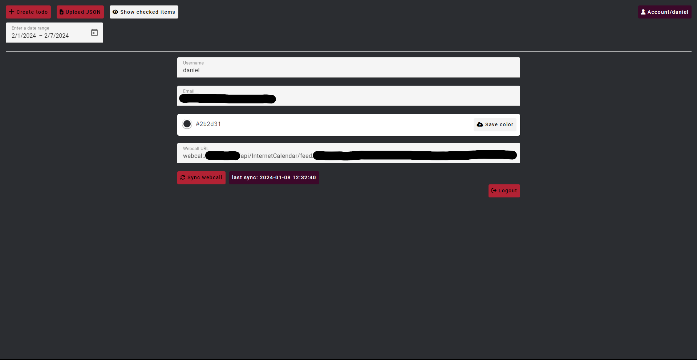

# dashboardTodo


<p align="center">
  
</p>

<h3 align="center">A dashbaord with clean overview of all your tasks for the upcomming 7 days.</h3>

<div align="center">
  <h3>
    <a href="#-features">Features</a>
    <span> | </span>
    <a href="https://github.com/danielmosss/dashboardTodo/issues">Issues</a>
  </h3>
</div>

<p align="center">
  
  
</p>

## 🚀 Features

* ✅ Dashboard with clean overview.
* ✅ Overview
      - 7 days (Default)
      - Select week (Datepicker)
* ✅ Responsive UI (I did my best 😅 feel free to make a PR with improvements)
* ✅ Upload Json (It works, not the best)
* ✅ Upload ICS files (with 1 or more events)
* ✅ (Un)check items
* ✅ Account settings
* ✅ Change background color
* ✅ Set webcall url (che.myx.nl supported)
* ✅ Login
* 🟧 Register - (Disabled endpoint) 
* ❌ Change username
* ❌ Forgot password


## ⌨️ How to use?

### Step 1: Clone the repo
  
  ```bash
  git clone https://github.com/danielmosss/dashboardTodo.git
  ```

  Or download the lastest release from [here](https://github.com/danielmosss/dashboardTodo/releases/latest)

### Step 2: Install NodeJS(v18.17.1) & Golang(v1.12.4) & Mysql
  
  * [NodeJS](https://nodejs.org/en/download/)
  * [Golang](https://golang.org/dl/)
  * [Mysql](https://dev.mysql.com/downloads/installer/)

### Step 3: Setup database
    
  ```bash
  cd database
  mysql -u root -p
  source todo.sql
  ```

### Step 4: Run Migrations (From old to new)

  ```bash
  cd database/migrations
  mysql -u root -p
  -- Run for each file in the folder from lowest to highest number.
  ```

### Step 5: Copy the .env-template and rename it to: .env
  
    ```bash
    cd api
    cp .env-template .env
    ```
  
    Fill in the .env file with your own settings.
  
    ```bash
    databaseConnectionString=root:passwordHere@tcp(localhost:portHere)/nameHere
    JWT_SECRET=secretHere
    ngrokRequest=ngrokRequestApiHere
    ```

    databaseConnectionString - Fill in your own database settings.
    JWT_SECRET - Fill in your own secret for the JWT token. This is a random string from anywhere between 32-64 characters.
    ngrokRequest - Fill in your own ngrok request url. **This is not used when running the app locally.**

### Step 5: Start the go restapi

  ```bash
  cd api
  go run main.go
  ```

### Step 6: Start the angular frontend

  ```bash
  cd angular/src
  ng serve --configuration development
  ```

### Step 7: Visit the dashboard

  For this you need to use a google browser and disable web security. 
  Here is a guide on how to do that: [Guide](https://alfilatov.com/posts/run-chrome-without-cors/)
  This is because CORS is not enabled for localhost:4200 in the go restapi.

  ```bash
  http://localhost:4200
  ```
