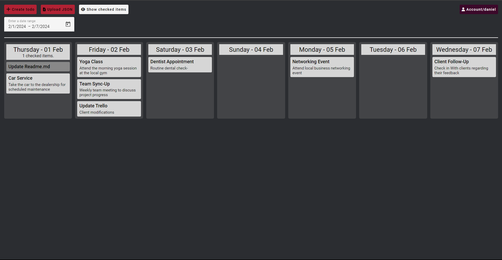

# DashboardTodo - Todolist(V1) and Agenda(V2) in one.
<ul>
  <li>Webapplication build with Angular, Golang and Mysql.</li>
  <li>Dashboard with a quick overview of your events today and the tasks for the upcoming 7 days.</li>
  <li>3 different agenda views: [day/week/month] </li>
  <li>Select a [day/week/month] with the angular datepicker.</li>
</ul>

<p align="center">
  
</p>

<div align=center>
  <h3>
    <a href="#-features">Features</a>
    <span> | </span>
    <a href="https://github.com/danielmosss/dashboardTodo/issues">Issues</a>
  </h3>
</div>

<!-- <p align="center">
  
  
</p> -->
<p align="center">
Screenshots are outdated. I will add new screenshots soon.
</p>

## 🚀 Features
> [!NOTE]  
> I'm working on new features.<br>
> Not all features are listed below.
* ✅ Dashboard with quick overview for desktop and mobile.
* ✅ Agenda with 3 different views:<br>
      - Day (Default: today)<br>
      - Week (Default: this week from sunday to saturday) [Landing view]<br>
      - Month (Default: this month)
* ✅ Responsive UI (I did my best 😅 feel free to make a PR with improvements)
* ✅ Standard TODO app features
* ✅ Account settings
* ✅ Color categories for agenda events. 
* ✅ Set webcall url (che.myx.nl supported)
* ✅ Login
* 🟧 Register (Disabled endpoint) 
* 🟧 Upload Json (outdated)
* 🟧 Upload ICS files (outdated)
* ❌ Change username
* ❌ Download backup of events and tasks
* ❌ Import your backups.


## ⌨️ How to use?

### Step 1: Clone the repo
  
  ```bash
  git clone https://github.com/danielmosss/dashboardTodo.git
  ```

  Or download the lastest release from [here](https://github.com/danielmosss/dashboardTodo/releases/latest)

### Step 2: Install NodeJS(v18.17.1) & Golang(v1.12.4) & Mysql
  
  * [NodeJS](https://nodejs.org/en/download/)
  * [Golang](https://golang.org/dl/)
  * [Mysql](https://dev.mysql.com/downloads/installer/)

### Step 3: Setup database
    
Run the todo-v2.sql and the migrations in the migration-v2 folder. 
Run the migrations from lowest to highest number.

### Step 4: Copy the .env-template and rename it to: .env
  
  ```bash
  cd api
  cp .env-template .env
  ```

  Fill in the .env file with your own settings.

  ```bash
  databaseConnectionString=root:passwordHere@tcp(localhost:portHere)/nameHere
  JWT_SECRET=secretHere
  ngrokRequest=ngrokRequestApiHere
  ```

  * databaseConnectionString - Fill in your own database settings.
  * JWT_SECRET - Fill in your own secret for the JWT token. This is a random string from anywhere between 32-64 characters.
  * ngrokRequest - Fill in your own ngrok request url. **This is not used when running the app locally.**


### Step 5: Start the go restapi

  ```bash
  cd api
  go run main.go
  ```

### Step 6: Install the angular dependencies

  ```bash
  cd angular/src
  npm install
  ```

### Step 7: Start the angular frontend

  ```bash
  cd angular/src
  ng serve --configuration development
  ```

### Step 8: Visit the dashboard

  For this you need to use a google browser and disable web security. 
  Here is a guide on how to do that: [Guide](https://alfilatov.com/posts/run-chrome-without-cors/)
  This is because CORS is not enabled for localhost:4200 in the go restapi.

  ```bash
  http://localhost:4200
  ```
